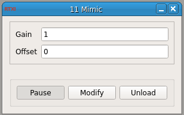

###Mimic Signal

**Requirements:** None  
**Limitations:** None  

Copies an input signal and outputs another with optional user-specified scaled gain or offset. 

####Input Channels:
1. input(0) - Vin : the signal to be mimicked

####Output Channels:
1. output(0) - Vout : the scaled and offset copy of the input

####Parameters:
1. Gain - scaling of the copied signal
2. Offset - offset of the copied signal

Note that the gain is a scalar multiplier, and the offset has the same units of the input signal. 
